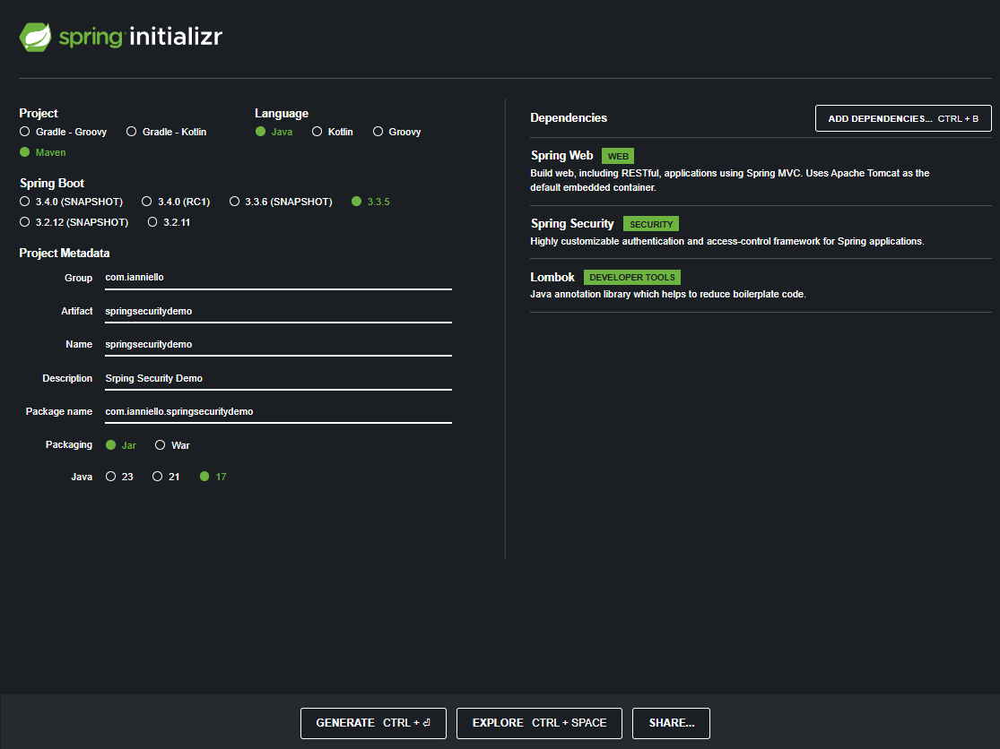

# Spring Security Demo

## Running Demo

* This project was built with below configuration - [Spring Init Link](https://start.spring.io/)

    

* project will be runned on -> [localhost:80](http://localhost:80/)

* login credentials
  * user: `user` 
  * pwd: `Retrived from Using generated security password` in app initialization

## Commands
* compile from terminal `mvn compile`
* running from terminal `mvn spring-boot:run`
* clean `mvn clean`

# Notes

## version 1.0
* Exception Handler added
* Basic Rest Controller for Student added
* Basic Dtos added
* favicon.ico added
* Basic Business logic for StudentService added
* Static Json and Random creation of student added
